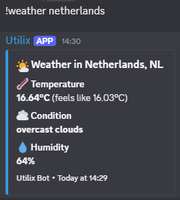

# Utilix Discord Bot 🤖

A multi-command Discord bot built with Python and discord.py.
Utilix offers a range of fun and utility commands including live weather, trivia, jokes and more.

## 📸 Preview

### Help Menu

### Weather Command

## ✨ Commands

| Command | Description | Usage |
|---|---|---|
| `!hello` | Greet the bot | `!hello` |
| `!ping` | Check response time | `!ping` |
| `!joke` | Get a random joke | `!joke` |
| `!8ball` | Ask the magic 8 ball | `!8ball Will it rain?` |
| `!coinflip` | Flip a coin | `!coinflip` |
| `!roll` | Roll a dice | `!roll 20` |
| `!weather` | Get live weather | `!weather Netherlands` |
| `!trivia` | Answer a trivia question | `!trivia` |
| `!poll` | Create a poll | `!poll "Best language?" "Python" "JavaScript"` |

## 🛠️ Built With
- Python
- discord.py
- OpenWeatherMap API
- Open Trivia DB API

## 🚀 Run Locally
1. Clone the repository
   git clone https://github.com/xtekkis/discord-bot.git
2. Install dependencies
   pip install discord.py python-dotenv requests
3. Create a .env file and add your tokens
   DISCORD_TOKEN=your_discord_token
   WEATHER_API_KEY=your_weather_api_key
4. Run the bot
   python bot.py